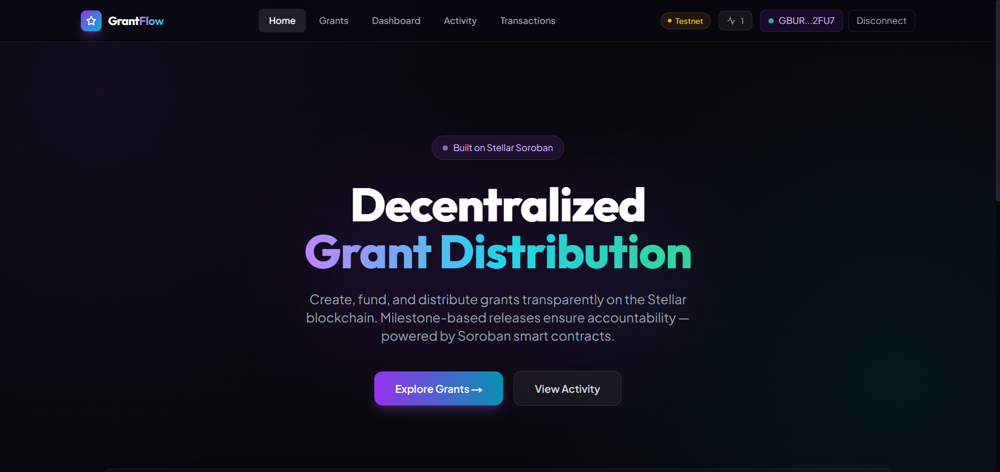
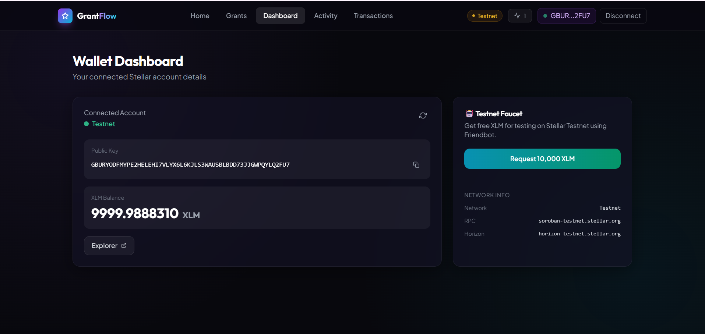
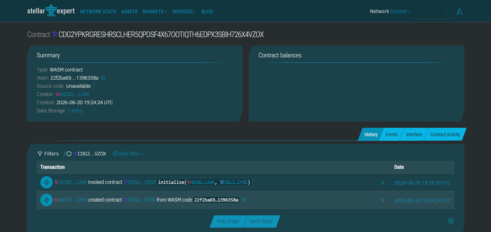

# Decentralized Grant Distribution Platform 🪙

A modern, decentralized crowdfunding and grant management web application for proposing, funding, and managing milestone-based grants using the **Stellar Network** and **Soroban Smart Contracts**.



## 🌟 Overview

The Decentralized Grant Distribution Platform is designed to enable transparent, secure, and milestone-governed crowdfunding. Project creators can propose grants, donors can fund projects directly using native XLM, and funds are automatically released or refunded governed strictly by smart contract rules.

### Core Features

- 🔐 **Wallet Integration:** Seamlessly connect multiple Stellar wallets (Freighter, xBull, Albedo, Lobstr, Hana) via `stellar-wallets-kit`.
- 💰 **Milestone Donations:** Donors contribute native XLM to projects, which are held securely in escrow by the smart contract.
- 🕒 **Live On-Chain Event Feed:** Polling mechanisms query contract event logs in real-time to show live contributions.
- 📋 **Admin Governance:** Administrators approve milestones to certify project compliance before funds are released.
- 💵 **Automated Release & Refund:** Recipients claim funds once the milestone is approved and target is met; otherwise, donors claim full refunds after the deadline passes.
- 📊 **Transaction Tracker:** Interactive sidebar showing real-time confirmation status for all pending transactions.



---

## 🏗️ Smart Contract Architecture

The core of the platform is governed by a **Soroban Smart Contract** written in Rust.

**Contract ID (Stellar Testnet):** 
[`CDG2YPKRGRESHRSCLHER5QPDSF4X67OOTIQTH6EDPX3SBIH726X4VZOX`](https://stellar.expert/explorer/testnet/contract/CDG2YPKRGRESHRSCLHER5QPDSF4X67OOTIQTH6EDPX3SBIH726X4VZOX)



### Contract Endpoints
- `initialize(admin: Address, token: Address)`: Binds the Admin governance address and the Native Token SAC.
- `create_grant(creator: Address, recipient: Address, target: i128, deadline: u64, description: String) -> u32`: Proposes a new grant with a specific funding target and expiration deadline.
- `donate(donor: Address, grant_id: u32, amount: i128)`: Escrows native XLM from donor into the contract for a specific grant.
- `approve_milestone(grant_id: u32)`: Marks the project milestone as approved (Admin only).
- `claim_funds(grant_id: u32)`: Releases escrows to the recipient once target is met and milestone is approved.
- `claim_refund(grant_id: u32, donor: Address)`: Returns contributions to a donor if the target is not reached by the deadline.
- `get_grant(grant_id: u32) -> Option<Grant>`: Retrieves the on-chain metadata for a grant.

---

## 💻 Tech Stack

**Frontend:**
- [Next.js](https://nextjs.org/) (App Router, React 19)
- [Tailwind CSS](https://tailwindcss.com/)
- [Zustand](https://zustand-demo.pmnd.rs/) (Client-side state management)
- [React Query](https://tanstack.com/query/latest) (Server state and automated polling)
- [Lucide Icons](https://lucide.dev/)

**Blockchain:**
- [Stellar SDK](https://github.com/stellar/js-stellar-sdk)
- [Soroban RPC](https://soroban.stellar.org/)
- [Stellar Wallets Kit](https://github.com/Creit-Tech/Stellar-Wallets-Kit)
- [Rust](https://www.rust-lang.org/) (Soroban Smart Contracts)

---

## 🚀 Getting Started

### Prerequisites

- [Node.js](https://nodejs.org/en/) (v18+)
- [Rust](https://www.rust-lang.org/) (v1.81.0 toolchain to build WASM without reference-types)
- [Freighter Wallet](https://www.freighter.app/) Browser Extension
- Stellar Testnet tokens (for testing)

### Installation

1. **Clone the repository:**
   ```bash
   git clone <your-repo-url>
   cd decentralized-grant-distribution-platform
   ```

2. **Install dependencies:**
   ```bash
   npm install
   ```

3. **Set up Environment Variables:**
   Create a `.env.local` file in the root directory:
   ```env
   NEXT_PUBLIC_CONTRACT_ADDRESS=CDG2YPKRGRESHRSCLHER5QPDSF4X67OOTIQTH6EDPX3SBIH726X4VZOX
   NEXT_PUBLIC_TOKEN_ADDRESS=CDLZFC3SYJYDZT7K67VZ75HPJVIEUVNIXF47ZG2FB2RMQQVU2HHGCYSC
   DEPLOYER_SECRET_KEY=SBQQE557YAPW35CAGACMZIQQTCBE63QODF744666UULUUDBSVN6GCXPG
   ```

4. **Compile the Soroban Contract:**
   ```bash
   npm run contract:compile
   ```

5. **Deploy & Initialize to Stellar Testnet:**
   ```bash
   npm run contract:deploy
   ```

6. **Run the Next.js development server:**
   ```bash
   npm run dev
   ```

7. Open [http://localhost:3000](http://localhost:3000) in your browser.

---

## 📝 License

This project is licensed under the MIT License.
